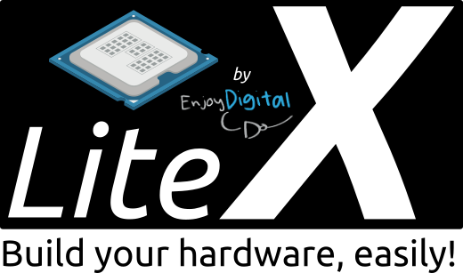

[](LICENSE)

# Containerized LiteX Development Environment

[](https://github.com/enjoy-digital/litex)

## Quick Overview

To quickly evaluate this environment, click `Use this template`, then `Open in a codespace`. Alternatively, run it locally using [Podman](https://podman.io/get-started).

### LiteX: A Python-based Hardware Description Framework
LiteX is a core element in our FPGA development strategy. It stands out for its Python-based domain-specific language, which significantly simplifies the description of complex digital circuits. Key technical highlights include:

1. **Modular and Configurable**: LiteX offers a modular architecture, allowing for flexible instantiation and configuration of CPU cores, peripherals, and memory controllers.
2. **Automated Bus and Memory Management**: It automates bus interconnects and CSR (Control and Status Register) generation, streamlining memory mapping and control.

### System Requirements

- **Operating System**: Compatible with most Linux distributions, macOS, and Windows (with WSL2).
- **Hardware**: A minimum of 8GB RAM and 20GB of free disk space.
- **Software Dependencies**: [Podman](https://podman.io/get-started) installed.

### Quick Start

Pull and run the pre-built LiteX development container:

```sh
podman run --rm -it ghcr.io/meriac/litex-dev:latest
```

Or with a persistent workspace:

```sh
# Create a workspace directory for persistent storage
mkdir -p workspaces

# Run the LiteX container with the workspace mounted
podman run \
  -h litex \
  --rm \
  -v $PWD/workspaces:/workspaces \
  -it ghcr.io/meriac/litex-dev:latest
```

This mounts the local `workspaces/` directory into the container at `/workspaces`, giving you persistent storage for your projects.

### Building and Running Locally

To build the containers from source and run them, use the Makefile in the `container/` directory:

```sh
cd container
make rebuild
```

This builds both container images from source and launches the base image. `make run` requires a prior local build — use `make rebuild` to build and run in one step. See [container/README.md](container/README.md) for the full list of build, publish and management targets.

### RISC-V Variant

LiteX SoCs typically instantiate a soft RISC-V CPU core (e.g. VexRiscv) on the FPGA. If you need to compile firmware that runs on that core, use the **`litex-dev-riscv`** image instead of the base image:

```sh
podman run --rm -it ghcr.io/meriac/litex-dev-riscv:latest
```

Or with a persistent workspace:

```sh
podman run \
  -h litex \
  --rm \
  -v $PWD/workspaces:/workspaces:U \
  -it ghcr.io/meriac/litex-dev-riscv:latest
```

The RISC-V image layers on top of the base image and adds:
- **`gcc-riscv64-unknown-elf`** — bare-metal RISC-V cross-compiler for building firmware that targets the soft CPU core
- **`meson`** and **`ninja`** — modern build systems used by many LiteX firmware projects
- **`zlib1g-dev`** — compression library required during firmware compilation

The base image is kept deliberately lean for users who only work on gateware (FPGA logic) and don't need to compile RISC-V firmware. The RISC-V cross-compiler toolchain adds significant size, so the split lets you pull only what you need.

> **Note:** The [VS Code Dev Container](.devcontainer/devcontainer.json) configuration uses the RISC-V variant by default, giving you a complete gateware + firmware workflow out of the box.

### Customizing the Development Environment

The `workspaces/` directory is bind-mounted into the container, so any files saved there persist on your host machine after the container exits.

To build the containers locally from source:

```sh
cd container
make build
```

This builds two images:
- `ghcr.io/meriac/litex-dev:<arch>` - Base LiteX environment
- `ghcr.io/meriac/litex-dev-riscv:<arch>` - Adds RISC-V cross-compiler, meson and ninja

To rebuild from scratch and launch:

```sh
make rebuild
```

## Resources & Troubleshooting

- [LiteX Github Repository](https://github.com/enjoy-digital/litex/)
- [Podman Documentation](https://docs.podman.io)

## License

Apache 2.0 - see [LICENSE](LICENSE)
